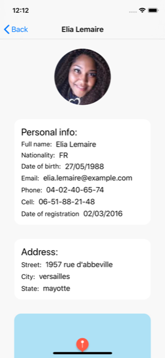

# OldUsers

iPhone/iPad application to get user information through https://randomuser.me API and display it in a basic list and a detail view.
**Before running** please install pods, by running `pod install` in the root folder.

